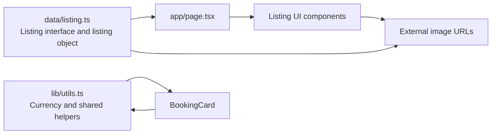
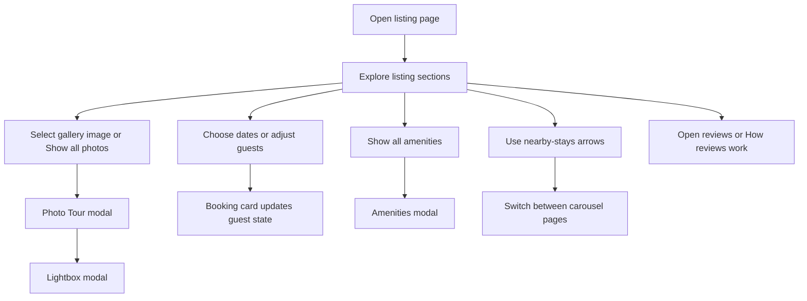
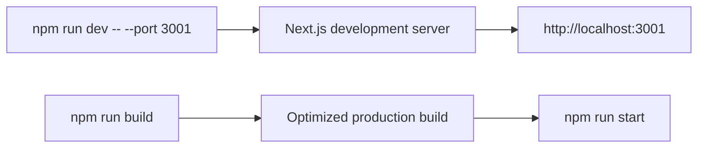

# Airbnb Listing Clone Architecture

## Application Architecture

```mermaid
flowchart TD
    Browser[User Browser]
    Next[Next.js App Router]
    Layout[app/layout.tsx]
    Page[app/page.tsx\nPage composition and UI state]
    Global[app/globals.css]
    PageCSS[app/page.module.css]

    Browser --> Next
    Next --> Layout
    Layout --> Page
    Layout --> Global
    Page --> PageCSS

    Page --> Header[Header\ncomponents/Header]
    Page --> Gallery[Gallery\ncomponents/Gallery]
    Page --> Property[Property Info\ncomponents/PropertyInfo]
    Page --> Highlights[Highlights\ncomponents/PropertyInfo/Highlights]
    Page --> Description[Description\ncomponents/PropertyInfo/Description]
    Page --> Sleeping[Sleeping Arrangements\ncomponents/Sleeping]
    Page --> Amenities[Amenities\ncomponents/Amenities]
    Page --> Calendar[Availability Calendar\ncomponents/Calendar]
    Page --> Reviews[Reviews\ncomponents/Reviews]
    Page --> Location[Location\ncomponents/Location]
    Page --> Host[Host\ncomponents/Host]
    Page --> Booking[Booking Card\ncomponents/Booking]
    Page --> Nearby[Nearby Stays\nRendered by app/page.tsx]
    Page --> Footer[Footer\ncomponents/Footer]

    Header --> HeaderCSS[Header.module.css]
    Gallery --> GalleryCSS[Gallery.module.css]
    Property --> PropertyCSS[PropertyInfo.module.css]
    Highlights --> HighlightsCSS[Highlights.module.css]
    Description --> DescriptionCSS[Description.module.css]
    Sleeping --> SleepingCSS[Sleeping.module.css]
    Amenities --> AmenitiesCSS[Amenities.module.css]
    Calendar --> CalendarCSS[Calendar.module.css]
    Reviews --> ReviewsCSS[Reviews.module.css]
    Location --> LocationCSS[Location.module.css]
    Host --> HostCSS[Host.module.css]
    Booking --> BookingCSS[BookingCard.module.css]
    Footer --> FooterCSS[Footer.module.css]
```

## Data Flow

## User Interaction Flow

## Directory Responsibilities

| Path | Responsibility |
| --- | --- |
| `app/page.tsx` | Main page composition, modal state, nearby-stay pagination, and page-level content |
| `app/layout.tsx` | Root layout, metadata, fonts, skip link, and global shell |
| `app/globals.css` | Global tokens, typography, buttons, focus states, and shared styles |
| `app/page.module.css` | Main page layout, columns, knowledge section, and nearby-stay carousel |
| `data/listing.ts` | Listing types and property data, including room-labelled images |
| `components/Header` | Airbnb-style navigation and search controls |
| `components/Gallery` | Hero image gallery and photo-tour entry point |
| `components/PropertyInfo` | Title, metadata, highlights, and description content |
| `components/Booking` | Reservation card, dates, guests, pricing, and offer banner |
| `components/Sleeping` | Sleeping arrangement cards |
| `components/Amenities` | Amenity list and modal for all amenities |
| `components/Calendar` | Two-month availability display |
| `components/Reviews` | Guest-favourite rating summary, categories, and review cards |
| `components/Location` | Location copy and map presentation |
| `components/Host` | Host profile, response information, and contact action |
| `components/PhotoTour` | Room-grouped full photo tour modal |
| `components/Lightbox` | Individual image lightbox navigation |
| `components/Footer` | Footer links and copyright |
| `hooks` | Reusable keyboard and scroll-lock behavior |
| `lib/utils.ts` | Shared formatting helpers |
| `public` | Static public assets |

## Runtime

